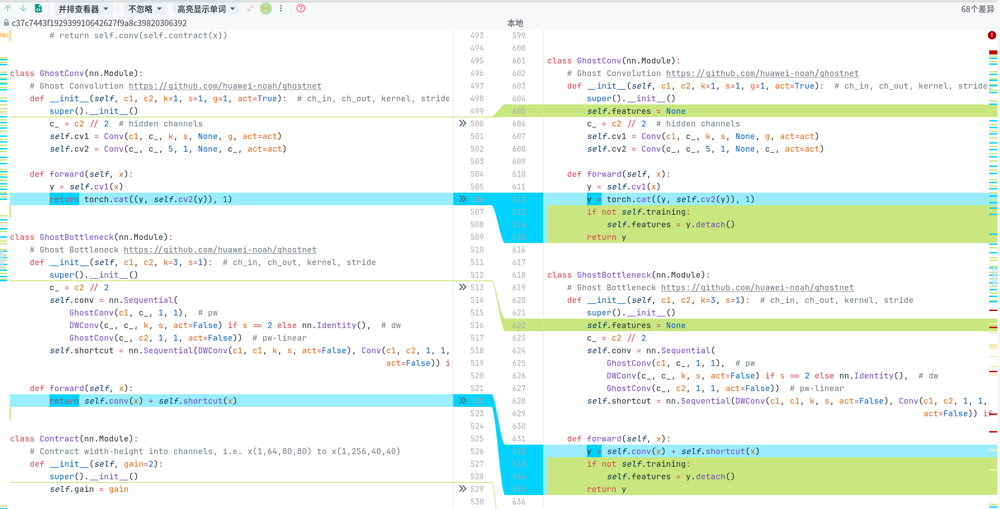
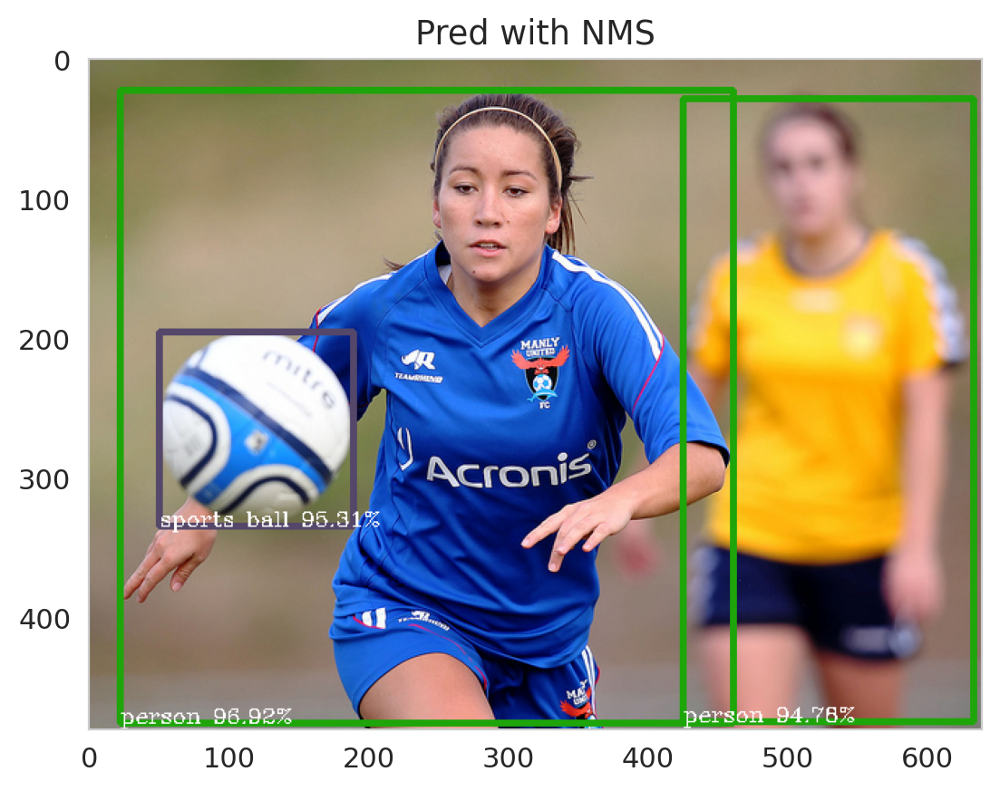
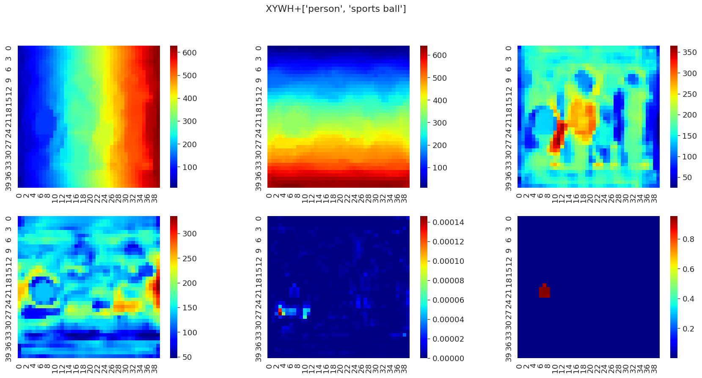
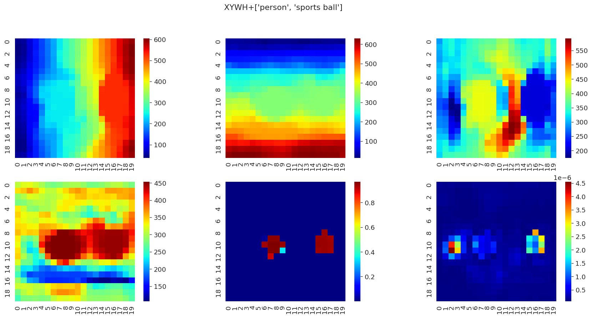
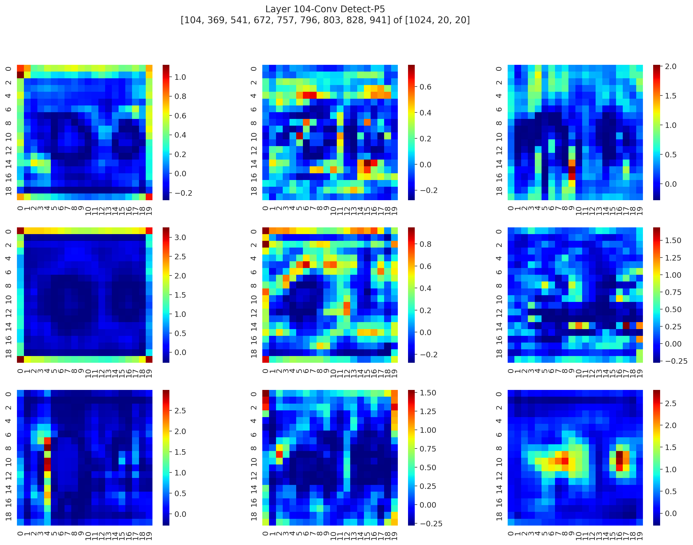

# yolov7-u6-visualization


# Yolov7 AnchorFree(u6) 版本的可视化分析和各层张量提取


 Visualization of each detection head and layer of Yolov7 AnchorFree(u6) Version


+ **开始前，请将原仓库的`u6`分支克隆到目录下**


```shell
git clone --recursive https://github.com/WongKinYiu/yolov7.git -b u6 --depth 1
```

+ **然后将修改好的common.py替换源代码**

他们之间的区别是：

在前向传播时，各个Module在return前剥离梯度流并拷贝一份(detach)，保存到self.features内。这样可以直接访问模型运行上一张图时各个模块的features特征张量。（如下图）



替换可以用如下脚本（如果你是linux请使用*`*mv*`*， Windows用户可以直接复制粘贴或者替换*`*mv*`*为*`*move*`*）

```shell
# On Linux
mv ./common.py ./yolov7/models/common.py

# On Windows
move ./common.py ./yolov7/models/common.py
```

+ **最后下载需要的 [权重文件](https://github.com/WongKinYiu/yolov7/releases/download/v0.1/yolov7-u6.pt) 到目录下**

```shell
wget https://github.com/WongKinYiu/yolov7/releases/download/v0.1/yolov7-u6.pt
```


**准备好后直接打开[vis.ipynb](./vis.ipynb)**


作者的其他相关仓库请移步:

[Yolo-Detect-Layer-Visualization](https://github.com/XiaMooo/Yolo-Detect-Layer-Visualization)

[yolov8-visualizations](https://github.com/XiaMooo/yolov8-visualizations)


下面是一些运行示例：

> 
>
> 
>
> 
>
> 


